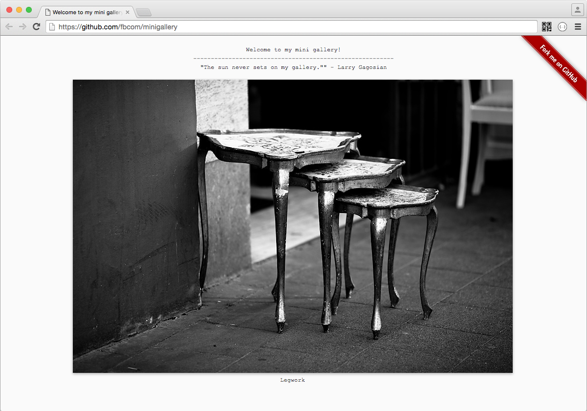

# minigallery

A minimalistic single file PHP gallery. Ideal for setting up a quick scratch gallery.

#### Preview:

#### Download:

Click [here](https://github.com/fbcom/minigallery/archive/master.zip) to download the gallery as a zip file.

#### Installation:

1. Just put the file index.php in the folder on your webserver where your images reside.
2. Change the settings in the configuration area in index.php as required.
3. Maybe add something to the footer.
4. Navigate your browser to the folder where you put index.php.

Adjust, extend, enjoy.

#### Liscense

This work is licensed under a Creative Commons Attribution-ShareAlike 3.0 Unported License.
